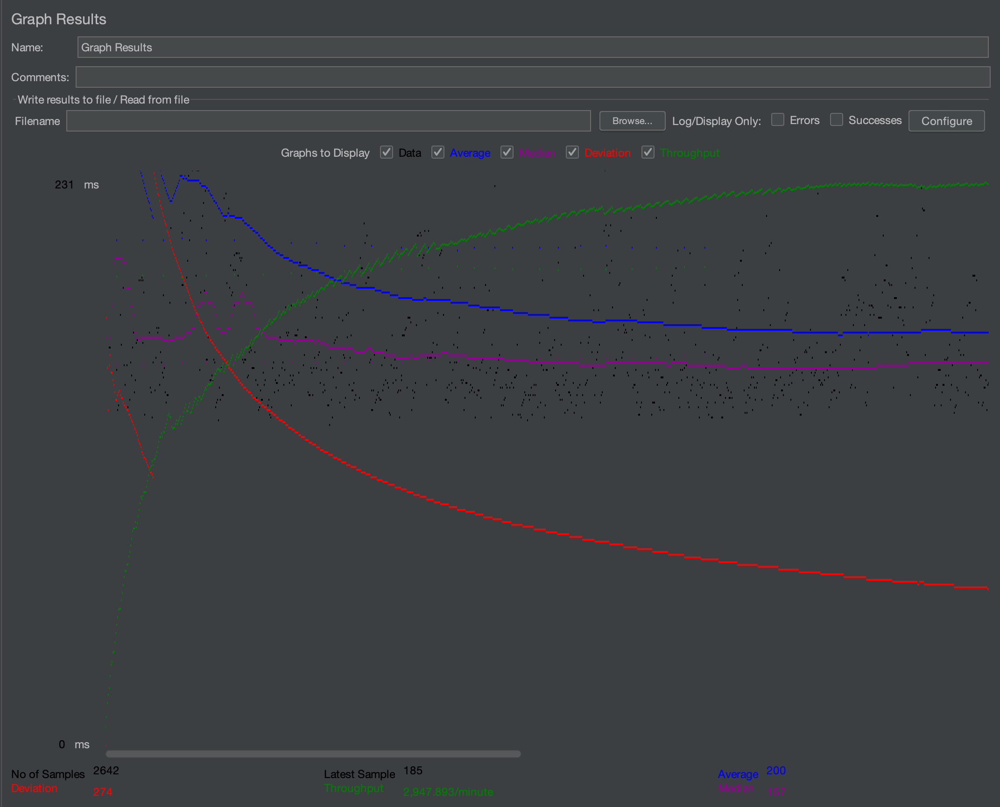

- # General

  - #### Team#: Matcha

  - #### Names: Leanne Nguyen

  - #### Project 5 Video Demo Link: https://youtu.be/QvzovpptaBU

  - #### Instruction of deployment: 

  - #### Collaborations and Work Distribution: I did all the work.

- # Connection Pooling

  - #### Include the filename/path of all code/configuration files in GitHub of using JDBC Connection Pooling.
- #### Created datasources with Connection Pooling in these files.
    1. [context.xml](cs122b-project1-api-example-main/WebContent/META-INF/context.xml)
    2. [web.xml](cs122b-project1-api-example-main/WebContent/WEB-INF/web.xml)
- #### These servlets get a connection and from the Connection Pool and use PreparedStatements for their queries and updates.
  1. [DomParser.java](cs122b-project1-api-example-main/src/DomParser.java)
  2. [AddStarServlet.java](cs122b-project1-api-example-main/src/AddStarServlet.java)
  3. [AuthPaymentServlet.java](cs122b-project1-api-example-main/src/AuthPaymentServlet.java)
  4. [EmployeeLoginServlet.java](cs122b-project1-api-example-main/src/EmployeeLoginServlet.java)
  5. [GenresServlet.java](cs122b-project1-api-example-main/GenresServlet.java)
  6. [LoginServlet.java](cs122b-project1-api-example-main/LoginServlet.java)
  7. [MetaDataServlet.java](cs122b-project1-api-example-main/MetaDataServlet.java)
  8. [MovieListServlet.java](cs122b-project1-api-example-main/MovieListServlet.java)
  9. [PlaceOrderServlet.java](cs122b-project1-api-example-main/PlaceOrderServlet.java)
  10. [SingleMovieServlet.java](cs122b-project1-api-example-main/SingleMovieServlet.java)
  11. [SingleStarServlet.java](cs122b-project1-api-example-main/SingleStarServlet.java)
  12. [StarsServlet.java](cs122b-project1-api-example-main/StarsServlet.java)
  13. [AddMovieServlet.java](cs122b-project1-api-example-main/src/AddMovieServlet.java)
  - #### Explain how Connection Pooling is utilized in the Fabflix code.
   Connection Pooling is used to manage and reuse database connections. When a servlet needs a connection, it requests one from the pool. If a connection is available, it is returned, otherwise, a new connection is created. Instead of closing connections after use, they are returned to the pool for reuse. Connection pooling enhances performance by minimizing the number of times servlets are creating and closing connections, which takes time and resources.

  - #### Explain how Connection Pooling works with two backend SQL.
   Each backend SQL has their own Connection Pool that they create and reuse connections from.

- # Master/Slave

  - #### Include the filename/path of all code/configuration files in GitHub of routing queries to Master/Slave SQL.
    [context.xml](cs122b-project1-api-example-main/WebContent/META-INF/context.xml) contains a datasource that routes to each Master and Slave instance to their own local SQL. I used a separate git branch (named slave) for the slave instance and added a datasource that is routed to the Master SQL. Any servlet that handles write requests on the Slave instance connects to the Master SQL datasource.

  - #### How read/write requests were routed to Master/Slave SQL?
    The load balancer directs the client to either the Master or Slave instance. Read requests were sent to the local SQL of each instance. All write requests on the Master instance were sent to the local SQL server. For the slave instance, I created a datasource in the context.xml file that connects to the Master SQL server. Any servlets in the slave instance that involve write requests used the Master datasource. This ensured that read requests were sent to each instance's local SQL server, and all write requests were sent to only the Master instance.
- # JMeter TS/TJ Time Logs

  - #### Instructions of how to use the `log_processing.*` script to process the JMeter logs.
  In commandline, run `python3 process_log.py path/file1name.txt path/file2name.txt`
   file2 is optional. Include a file2 if you're running the scaled version and have 2 log files for the Master and Slave instance.

- # JMeter TS/TJ Time Measurement Report

| **Single-instance Version Test Plan**         | **Graph Results Screenshot**        | **Average Query Time(ms)** | **Average Search Servlet Time(ms)** | **Average JDBC Time(ms)** | **Analysis** |
| --------------------------------------------- |-------------------------------------| -------------------------- | ----------------------------------- | ------------------------- | ------------ |
| Case 1: HTTP/1 thread                         |  | 212                        | 3.84                                | 2.92                      | The average query time for 1 thread vs 10 threads(case 2) is about the same. However, the number of threads greatly increase the number of requests that can be processed in a minute. 1 thread was completing requests 278 requests per minute, which 10 threads were completing 2947 requests per minute.            |
| Case 2: HTTP/10 threads                       |  | 200                        | 5.76                                | 5.28                      | HTTP requests are redirected to HTTPS, which would explain why the average query time for HTTP requests was double the average query time for HTTPS requests.  |
| Case 3: HTTPS/10 threads                      |  | 106                        | 7.65                                | 7.31                      | The average search time was lesser with connection pooling. This time was reduced with the connection pooling since the servlet didn't need to take time to create a new connection for every servlet.           |
| Case 4: HTTP/10 threads/No connection pooling |  | 220                        | 12.39                               | 5.66                      | The average search time is greater with no connection pooling. This extra time is likely the servlet creating a new connection for every request.           |

| **Scaled Version Test Plan**                  | **Graph Results Screenshot** | **Average Query Time(ms)** | **Average Search Servlet Time(ms)** | **Average JDBC Time(ms)** | **Analysis** |
| --------------------------------------------- | ---------------------------- | -------------------------- | ----------------------------------- | ------------------------- | ------------ |
| Case 1: HTTP/1 thread                         |    | 99                         | 2.98                                | 2.58                      | The average query time for the scaled version is about half of the single-instance version. This is because the requests are split between two instances, so the requests are in queue for less time.           |
| Case 2: HTTP/10 threads                       |    | 88                         | 3.84                                | 2.95                      | Like the single-instance version, using 10 threads increases the number of requests that can be processed in a minute. 1 thread of the scaled version completed 664 requests per minute, while 10 threads of the scaled-version completed 6625 requests per minute.           |
| Case 3: HTTP/10 threads/No connection pooling |    | 96                         | 6.00                                | 3.56                      | The average search time is greater with no connection pooling. This extra time is likely the servlet creating a new connection for every request.           |
